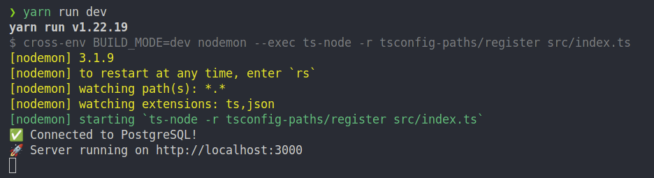
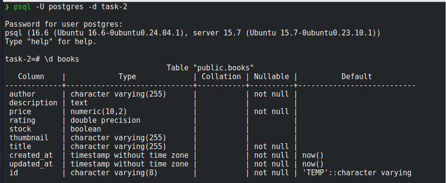
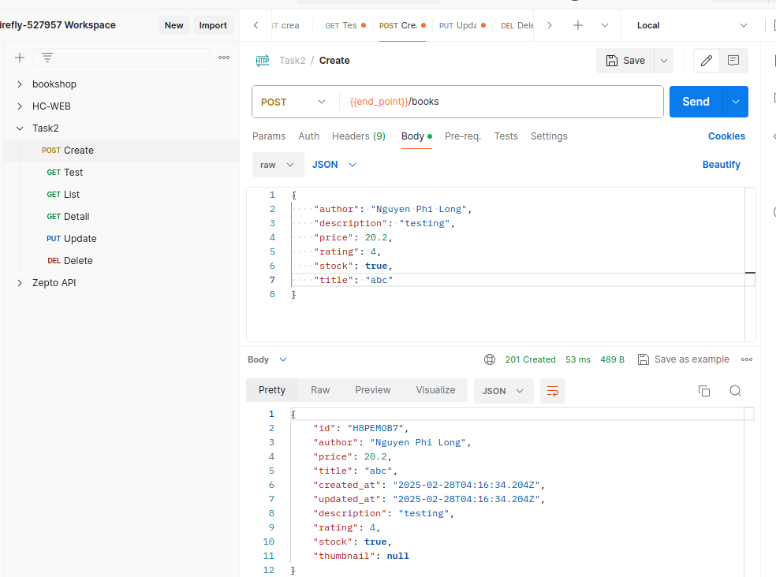
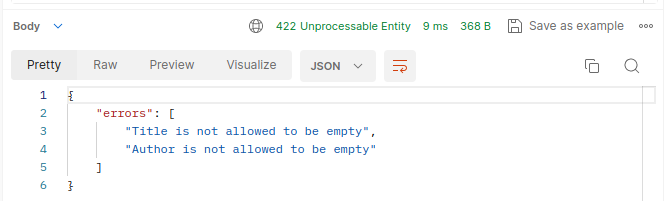
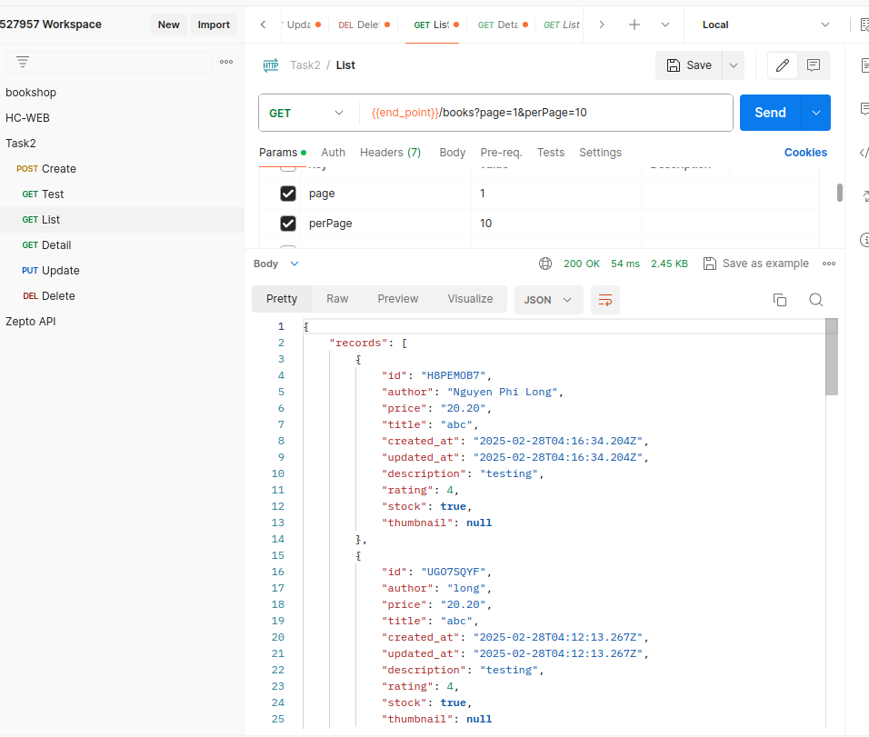
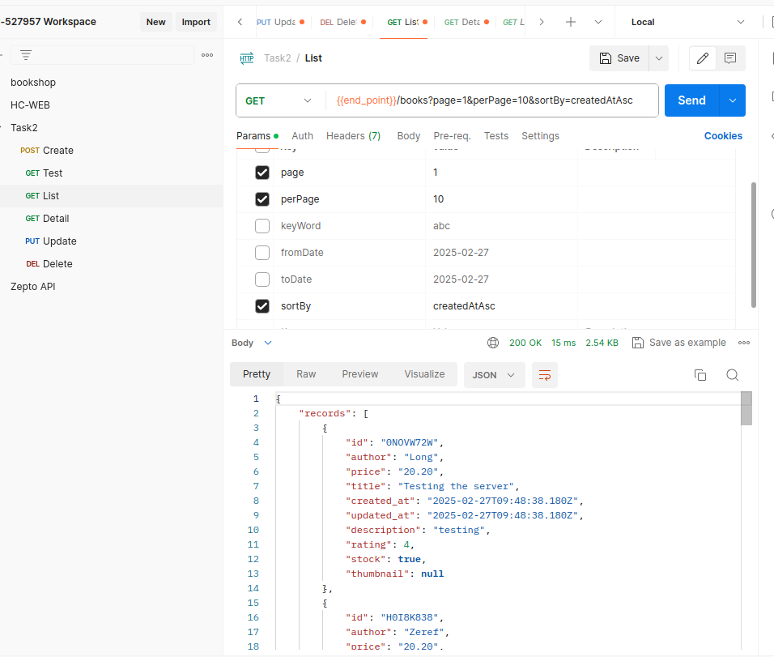

### 📂 Project Structure

Below is the directory structure of the project:

| Folder         | Description |
|---------------|------------------------------------------------|
| `config/`      | Contains application configuration files (database) |
| `controllers/` | Handles request/response logic |
| `entities/`    | Defines database entities (TypeORM) |
| `interfaces/`  | Contains TypeScript interfaces |
| `middlewares/` | Contains request handling middleware (validation) |
| `migrations/`  | Stores database migration files (TypeORM) |
| `routes/`      | Defines API routes |
| `services/`    | Contains business logic services |
| `utils/`       | Contains utility functions used across the project |
| `validations/` | Contains schema validations using Joi |


### 📌 Prerequisites

I am using the following versions:

- **Node.js**: `18.18.0`
- **Yarn**: `1.22.19`
- **PostgreSQL**

### 📄 1. Create `.env` File

Create a `.env` file in the root directory and configure the environment variables:

```env
# Server Config
PORT=3000

# Database Config
DB_HOST=localhost
DB_PORT=5432
DB_USER=user
DB_PASSWORD=password
DB_NAME=db_name
```

### 📦 2. Install Dependencies
```
yarn install
```

### 🎯 3. Create Database
```
psql -U your_user -c "CREATE DATABASE db_name;"
```

### 🛠 4. Run Database Migrations
```
yarn run migration:run
```

### 🚀 5. Start
```
yarn run dev
```

### Result

#### Start Server ⚡



#### Database 🛢️



#### Create Record ✏️



#### Error Message ❌



#### Item List 📋



#### Sorted List 🔽🔼

