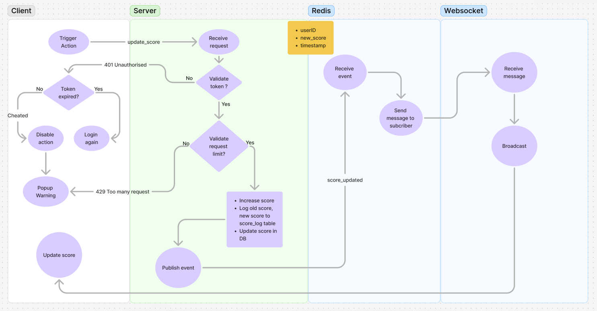

# Real-time Scoreboard System

## 📌 Problem Statement
A real-time scoreboard that updates instantly whenever users perform an action that increases their score. The scoreboard should show the **top 10 users** and be resistant to unauthorized score manipulations.

## 🛠️ Requirements
1. **Live Update Scoreboard:**  
   - The scoreboard must always be updated in real-time whenever a user's score changes.

2. **User Action -> Score Update:**
   - Whenever a user performs an action, the system must update the user's score on the server.
   - The API responsible for updating the score must be secure to prevent cheating.
     - Only accept requests from valid domains (CORS policy).
     - Limit the number of score updates per second (e.g., a maximum of 5 times per minute).
     - Do not allow direct score updates, only accept +1 point per successful action.
     - Server checks the user's ID from the JWT to ensure they cannot update someone else's score.

3. **Fraud Prevention:**
   - **Authentication & Authorization** to verify users.  
   - **Request Limiting** to prevent abuse.  
   - **Server-Side Validation** to ensure valid score updates.
   - **Audit Log** to maintain score history to detect fraudulent activities


## Technology Stack
This project is built with the following technologies:

- **Node.js, Express.js, TypeScript**:  Write APIs to update scores
- **PostgreSQL**: Save user scores
- **Redis**: Transmit score change events between services
- **Websocket**: Push real-time data to the client
- **JWT (JSON Web Token)**: Authenticate

## Architecture
This project follows the **MVC (Model-View-Controller)** pattern

## Ideas
#### Step 1: The user performs an action and sends a request to update the score
1. When a user performs an action, the frontend calls the /update_score API
2. Server receives the request, validates it (JWT token, anti-spam measures)
3. If valid, server increments the user's score in PostgreSQL
4. After updating, server publishes a "score_updated" event to Redis.

#### Step 2: Backend processes the score update & Publishes the Redis event
1. Server receives the request, retrieves the userId and score.
2. Validates the user (JWT, request limit).
3. Log the history of updated scores.
4. Updates the score in PostgreSQL.
5. Publishes the "score_updated" event to Redis with the new data.

#### Step 3: WebSocket Server Subscribes to Redis & Sends Real-time Data to Client
1. The WebSocket server subscribes to the "score_updated" event from Redis.
2. When an event is received from Redis, the server broadcasts the data to all connected WebSocket clients.
3. The client receives the new score and updates the interface immediately.

## Flow Diagram
Apologies for the lack of professionalism, as I have exhausted the free resources on Lucidchart, so I temporarily created the diagram in Figma

[Click here to view on Figma](https://www.figma.com/board/tyKsHu6jbL2vqI7OGRDlyB/ScoreBoard?t=c0oT2Lm26Dl86wgs-1)

## Database Schema
Relationship:
- users (1) - (1) scores
- users (1) - (N) score_log

### Users Table
Save user info

| Column   | Type         | Description          |
|----------|-------------|----------------------|
| id       | UUID (PK)   | Unique identifier for user |
| username | VARCHAR(255) | User's name      |
| created_at | TIMESTAMP  | Timestamp of the create      |

---

### Scores Table
Save the current score of each user.

| Column    | Type         | Description             |
|-----------|-------------|-------------------------|
| id        | UUID (PK)   | Unique identifier for the score   |
| user_id   | UUID (FK)   | Linked to `users.id` |
| score     | INTEGER     | Current score        |
| updated_at | TIMESTAMP  | Last update timestamp |

---

### Score Log Table
Save the history of score changes.

| Column       | Type         | Description                     |
|-------------|-------------|---------------------------------|
| id          | UUID (PK)   | Unique identifier for the log record            |
| user_id     | UUID (FK)   | Linked to `users.id`         |
| old_score   | INTEGER     | Old score                      |
| new_score   | INTEGER     | New score                      |
| score_change | INTEGER    | Amount of score change                |
| reason      | TEXT        | Reason for the score change         |
| created_at  | TIMESTAMP  | Timestamp of the update              |

## APIs
- POST: {ENDPOINT}/api/v1/user/login\
  **Interface Request**
  ```
  "username": string,
  "password": string
  ```
  **Interface Response**
  ```
  "access_token": string
  ```
- GET: {ENDPOINT}/api/v1/scores/top_scores\
  **Headers**
  ```
  Authorization: access_token
  ```
  **Interface Response**
  ```
  "records": [
    {
      "rank": integer,
      "userId": string,
      "username": string,
      "score": integer
    }
  ]
  ```
- PUT: {ENDPOINT}/api/v1/scores\
  **Headers**
  ```
  Authorization: access_token
  ```
  **Interface Request**
  ```
  "userId": string,
  "score": integer,
  "reason": string
  ```
  **Interface Response**
  ```
  "message": string,
  "score": integer
  ```